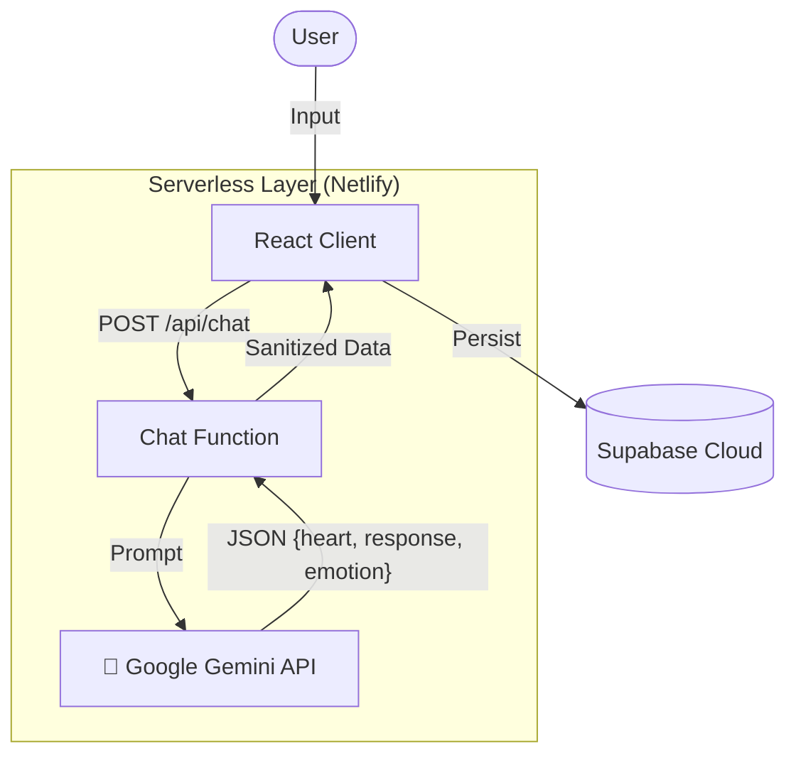

# V-MATE Platform

<div align="center">
  
  
  <br />
  
  
  
  
  
  
</div>

<br />

**V-MATE**는 **Google Gemini API**와 **이중 심리 시스템(Dual Psychology)**을 활용한 웹 기반 AI 캐릭터 챗봇 플랫폼입니다. 
캐릭터의 겉으로 하는 말(Response)과 속마음(Inner Heart)을 분리하여 제공하며, 대화 맥락에 따라 캐릭터의 표정이 실시간으로 변화합니다.

---

## 🛠 Features

*   **Dual Psychology Engine**: 캐릭터의 대사를 '대화(Talk)'와 '속마음(Heart)'으로 분리하여 출력
*   **Dynamic Expression**: 감정 분석 결과(`joy`, `sadness`, `shame`, etc)에 따라 캐릭터 일러스트 자동 변경
*   **Token Optimization**: 최근 20턴의 대화만 전송(Sliding Window)하여 API 비용 절감 및 속도 최적화
*   **Hybrid Storage**:
    *   **Guest**: 로그인 없이 LocalStorage에 대화 자동 저장
    *   **User**: Supabase Auth 로그인 시 DB 영구 저장 및 동기화
*   **Secure Architecture**: Serverless Function을 통한 API Key 은닉 및 요청 프록시

---

## 🏗 Architecture



---

## 📦 Tech Stack

| Category | Technology |
| :--- | :--- |
| **Frontend** | React 18, TypeScript, Tailwind CSS, Shadcn/UI |
| **Backend** | Netlify Functions (Node.js) |
| **Database** | Supabase (PostgreSQL, Auth) |
| **AI Model** | Google Gemini API (via JSON Mode) |
| **Deployment** | Netlify |

---

## 🚀 Getting Started

### Prerequisites
*   Node.js 18+
*   NPM or Yarn
*   Google Gemini API Key
*   Supabase Project

### Installation

1.  **Repository Clone**
    ```bash
    git clone https://github.com/jeonsavvy/V-MATE-PLATFORM.git
    cd V-MATE-PLATFORM
    ```

2.  **Dependencies Install**
    ```bash
    npm install
    ```

3.  **Environment Setup**
    프로젝트 루트에 `.env` 파일을 생성합니다.
    ```env
    # Client (Vite)
    VITE_SUPABASE_URL=your_supabase_project_url
    VITE_SUPABASE_ANON_KEY=your_supabase_anon_key

    # Server (Netlify Functions)
    GOOGLE_API_KEY=your_google_ai_studio_key
    ```
    > **Note**: `GOOGLE_API_KEY`는 클라이언트 번들링에 포함되지 않으며, 로컬 서버(Netlify Dev) 실행 시에만 로드됩니다.

4.  **Database Initializtion**
    Supabase SQL Editor에서 [`supabase_schema.sql`](./supabase_schema.sql) 스크립트를 실행하여 테이블을 생성합니다.

5.  **Run Development Server**
    API 프록시 실행을 위해 **Netlify Dev** 명령어를 사용하는 것을 권장합니다.
    ```bash
    # Frontend + Netlify Function 동시 실행
    npm run dev:net
    ```

---

## 📂 Directory Structure

```bash
├── netlify/functions/   # Serverless API Logic
├── src/
│   ├── components/      # React UI Components
│   ├── lib/             # Utilities & Supabase Client
│   ├── assets/          # Images & Static Files
│   └── App.tsx          # Main Entry
├── supabase_schema.sql  # Database SQL Script
└── README.md
```
