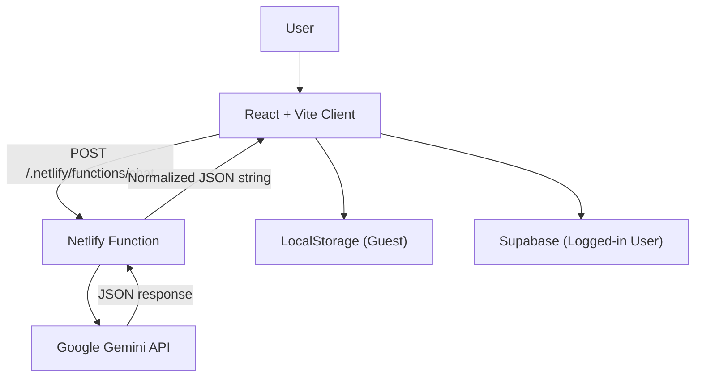

# V-MATE

캐릭터의 **겉말(response)** 과 **속마음(inner_heart)** 을 분리해 보여주는 웹 기반 AI 캐릭터 채팅 프로젝트입니다.

---

## 핵심 흐름



---

## 현재 구현 기능

- **Dual Psychology 출력**: `emotion`, `inner_heart`, `response`
- **표정 변경**: 응답 emotion 값에 따라 캐릭터 이미지 변경
- **하이브리드 저장**:
  - 비로그인: LocalStorage
  - 로그인: Supabase `chat_messages` 테이블
- **서버리스 프록시**: Gemini API Key는 Netlify Function에서만 사용
- **모델 고정**: 기본 `gemini-3-flash-preview` 단일 모델 사용 (환경 변수로 오버라이드 가능)
- **동일 모델 재시도 없음**: 모델 요청은 단일 시도로만 처리
- **Gemini Context Cache 재사용**: 캐릭터별 시스템 프롬프트 캐시를 `cachedContent`로 재사용해 재요청 비용 절감
- **JSON Mode 요청**: `responseMimeType: "application/json"`
- **Origin allowlist CORS**: `ALLOWED_ORIGINS` 기반 허용
- **요청 제한**: Origin/IP 키 기반 rate limit 적용
- **응답 정규화**: 서버에서 `emotion / inner_heart / response` 스키마 보정 후 반환
- **프롬프트 모듈 분리**: `src/lib/prompts/*`에서 캐릭터별 시스템 프롬프트 관리
- **UI 리프레시**: 홈/채팅 화면 글래스모피즘+그라디언트 기반 시각 개선

---

## 빠른 시작

### 1) 의존성 설치

```bash
npm install
```

### 2) 환경 변수

프로젝트 루트 `.env` 파일:

```env
# Client
VITE_SUPABASE_URL=...
VITE_SUPABASE_ANON_KEY=...

# Netlify Function
GOOGLE_API_KEY=...

# Optional
GEMINI_HISTORY_MESSAGES=6
GEMINI_MAX_PART_CHARS=1200
GEMINI_MAX_SYSTEM_PROMPT_CHARS=3500
GEMINI_MODEL_TIMEOUT_MS=14000
FUNCTION_TOTAL_TIMEOUT_MS=17000
FUNCTION_TIMEOUT_GUARD_MS=1500
GEMINI_MODEL_NAME=gemini-3-flash-preview
GEMINI_CONTEXT_CACHE_ENABLED=true
GEMINI_CONTEXT_CACHE_TTL_SECONDS=21600
GEMINI_CONTEXT_CACHE_CREATE_TIMEOUT_MS=1800
GEMINI_CONTEXT_CACHE_WARMUP_MIN_CHARS=1200
GEMINI_CONTEXT_CACHE_AUTO_CREATE=false
ALLOWED_ORIGINS=http://localhost:5173,https://your-domain.com
ALLOW_ALL_ORIGINS=false
RATE_LIMIT_WINDOW_MS=60000
RATE_LIMIT_MAX_REQUESTS=30
```

### 3) DB 초기화

Supabase SQL Editor에서 `supabase_schema.sql` 실행

### 4) 로컬 실행

```bash
npm run dev:net
```

> `dev:net`은 Vite + Netlify Function을 같이 실행하기 위해 권장됩니다. (글로벌 netlify CLI 없이 npx로 실행)

---

## 설정 메모

- 기본 히스토리 윈도우: `GEMINI_HISTORY_MESSAGES` (기본 6)
- 모델: 기본 `gemini-3-flash-preview` (필요 시 `GEMINI_MODEL_NAME`으로 오버라이드, 모델 fallback 없음)
- 동일 모델 재시도: 없음(0회, 단일 시도)
- 시스템 프롬프트 최대 길이: `GEMINI_MAX_SYSTEM_PROMPT_CHARS` (기본 3500)
- 모델 요청 타임아웃: `GEMINI_MODEL_TIMEOUT_MS` (기본 14000ms)
- Netlify 함수 총 실행 예산: `FUNCTION_TOTAL_TIMEOUT_MS` (기본 17000ms)
- 함수 종료 가드: `FUNCTION_TIMEOUT_GUARD_MS` (기본 1500ms)
- Gemini Context Cache: `GEMINI_CONTEXT_CACHE_ENABLED` (기본 true)
- Context Cache TTL: `GEMINI_CONTEXT_CACHE_TTL_SECONDS` (기본 21600초)
- Cache 생성 타임아웃: `GEMINI_CONTEXT_CACHE_CREATE_TIMEOUT_MS` (기본 1800ms)
- Cache 워밍 기준 길이: `GEMINI_CONTEXT_CACHE_WARMUP_MIN_CHARS` (기본 1200자)
- Cache 자동 생성: `GEMINI_CONTEXT_CACHE_AUTO_CREATE` (기본 false)
- 기본 Rate Limit: 60초당 30회(`RATE_LIMIT_WINDOW_MS`, `RATE_LIMIT_MAX_REQUESTS`)
- CORS는 `ALLOWED_ORIGINS`에 등록된 Origin만 허용
- 클라이언트에서 service role key 감지 시 Supabase를 비활성화하고 placeholder client로 대체
- API 실패/파싱 실패 시 캐릭터별 fallback 대사 출력(클라이언트 레벨 유지)

---

## 캐릭터 프롬프트 수정 가이드

- 공통 규칙: `src/lib/prompts/common.ts`
- 캐릭터별 규칙:
  - `src/lib/prompts/mika.ts`
  - `src/lib/prompts/alice.ts`
  - `src/lib/prompts/kael.ts`
- `src/lib/data.ts`에서는 캐릭터 메타/이미지/인사말만 유지하고, 시스템 프롬프트는 모듈 import로 조합합니다.
- 출력 계약은 기존과 동일하게 `emotion`, `inner_heart`, `response` JSON 스키마를 사용합니다.

---

## 주의사항 (현재 상태)

- 운영 중 CORS 긴급 완화가 필요하면 `ALLOW_ALL_ORIGINS=true`로 일시 완화할 수 있습니다(기본값은 `false` 권장).
- 대화 히스토리 기본값은 6이며, `GEMINI_HISTORY_MESSAGES`로 조정할 수 있습니다.

---

## 디렉터리

```bash
├── netlify/functions/chat.js
├── src/components/
├── src/lib/
│   └── prompts/
│       ├── common.ts
│       ├── mika.ts
│       ├── alice.ts
│       ├── kael.ts
│       └── index.ts
├── supabase_schema.sql
├── netlify.toml
└── README.md
```
