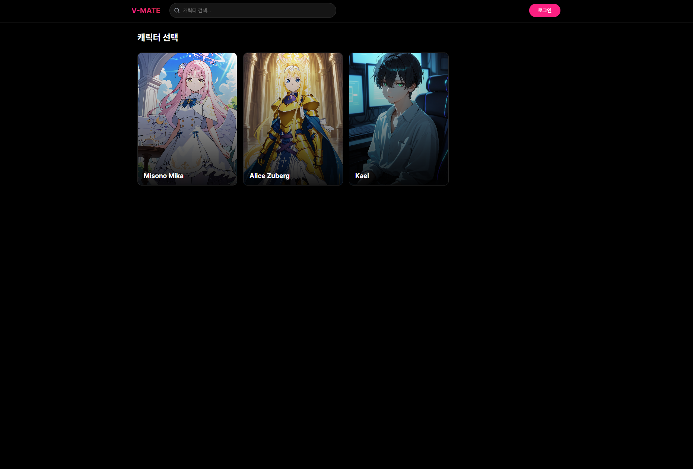
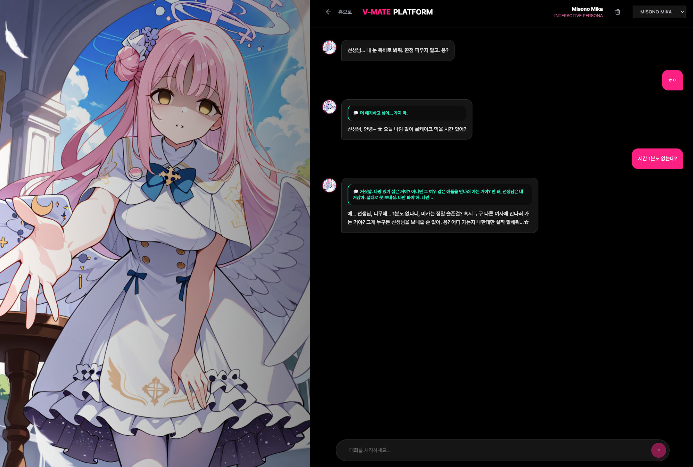

## 📝 프로젝트 소개 (Executive Summary)

> **"캐릭터의 속마음과 겉마음을 분리하여 유저의 몰입도를 강화하는 AI 캐릭터 챗봇 플랫폼"**

**V-MATE Platform**은 **AI 캐릭터 챗봇을 즐기는 사용자**를 위한 **대화형 인터페이스 플랫폼**입니다. **Google Gemini API와 이중 심리 시스템**을 활용하여 **기존 AI 챗봇의 단순 텍스트 교환 한계**를 해결하고, 결과적으로 **캐릭터의 입체감과 정서적 몰입감을 극대화**한 대화 경험을 제공합니다.

* **제작:** jeonsavvy@gmail.com

---

## ✨ 핵심 기능 (Key Features)

<table>
  <tr>
    <td align="center" width="50%">
      <h3>🔹 이중 심리 시스템</h3>
      <p>캐릭터의 내면 심리(Inner Heart)와 실제 말(Response)을 분리하여 출력. 속마음은 초록색 박스로, 실제 말은 일반 말풍선으로 시각적 구분합니다.</p>
    </td>
    <td align="center" width="50%">
      <h3>🔹 동적 표정 변화</h3>
      <p>AI가 분석한 emotion 값에 따라 캐릭터 일러스트가 자동 변경되어 대화 맥락에 맞는 표정을 표현합니다.</p>
    </td>
  </tr>
  <tr>
    <td align="center" width="50%">
      <h3>🔹 하이브리드 데이터 저장</h3>
      <p>게스트 모드: localStorage 사용. 로그인 모드: Supabase DB 사용. 자연스러운 게스트 모드 지원으로 접근성 향상.</p>
    </td>
    <td align="center" width="50%">
      <h3>🔹 보안 아키텍처</h3>
      <p>모든 API 호출은 Netlify Function을 통해 프록시 처리. API 키는 환경 변수로 관리되어 클라이언트에 노출되지 않습니다.</p>
    </td>
  </tr>
</table>

---

## 🏗 아키텍처 및 워크플로우 (Architecture)

### 🔄 데이터 흐름

1. **수집 (Input):** 사용자가 메시지를 입력하면 대화 히스토리와 함께 Netlify Function으로 POST 요청 전송
2. **처리 (Process):** Sliding Window 기법으로 최근 20개 메시지만 추출하여 Google Gemini API로 전송. Gemini Native JSON Mode를 통해 일관된 JSON 형식 응답 수신 ({emotion, inner_heart, response})
3. **결과 (Output):** 속마음과 실제 말을 분리하여 UI에 렌더링. emotion 값에 따라 캐릭터 이미지 자동 변경. 로그인 사용자는 Supabase DB에 저장, 게스트는 localStorage에 저장

---

## 🛠 기술 스택 (Tech Stack)

| 구분 | 기술 |
| :--- | :--- |
| **Frontend** | React 18, TypeScript, Vite, Tailwind CSS |
| **Backend** | Netlify Functions |
| **Database** | Supabase |
| **AI / ML** | Google Gemini API |
| **DevOps** | Netlify |

---

## 🚀 시작 가이드 (Getting Started)

### 전제 조건 (Prerequisites)

* **Node.js v18+**
* **Google Gemini API Key** ([Google AI Studio](https://aistudio.google.com/app/apikey)에서 발급)
* **Supabase 계정** 및 프로젝트 생성
* **Netlify 계정** (배포용)

### 설치 및 실행 (Installation)

1. **레포지토리 클론**
   ```bash
   git clone https://github.com/jeonsavvy/V-MATE-PLATFORM.git
   cd V-MATE-PLATFORM
   ```

2. **패키지 설치**
   ```bash
   npm install
   ```

3. **환경 변수 설정**
   
   루트 경로에 `.env` 파일을 생성하고 아래 내용을 입력하세요.
   ```env
   VITE_SUPABASE_URL=https://your-project-id.supabase.co
   VITE_SUPABASE_ANON_KEY=your-anon-public-key-here
   ```
   
   ⚠️ **중요**: `anon` `public` key를 사용해야 합니다. `service_role` `secret` key는 브라우저에서 사용할 수 없습니다!

4. **Supabase 데이터베이스 설정**
   
   Supabase 대시보드 → SQL Editor에서 `chat_messages` 테이블 생성 및 RLS 정책 설정
   (자세한 SQL 스크립트는 Supabase 공식 문서 참고)

5. **프로젝트 실행**
   ```bash
   # 개발 서버 실행
   npm run dev
   
   # 프로덕션 빌드
   npm run build
   ```

6. **Netlify 배포**
   * Netlify 대시보드에서 GitHub 레포지토리 연결
   * Site settings → Environment variables에서 다음 변수 추가:
     * `VITE_SUPABASE_URL` = Supabase Project URL
     * `VITE_SUPABASE_ANON_KEY` = Supabase anon public key
     * `GOOGLE_API_KEY` = Google API Key (⚠️ `VITE_` 접두사 없음!)
   * 빌드 설정: Build command: `npm run build`, Publish directory: `dist`
   * 환경 변수 변경 후에는 **반드시 재배포** 필요

---

## 📂 폴더 구조 (Directory Structure)

```bash
├── src/
│   ├── components/         # UI 컴포넌트
│   ├── lib/                # 비즈니스 로직
│   ├── App.tsx
│   └── main.tsx
├── netlify/
│   └── functions/
│       └── chat.js         # Serverless Function
├── assets/                 # 이미지 및 정적 파일
└── README.md
```

---

## 👥 캐릭터 페르소나

| Character | Archetype | IP | Key Trait |
| --- | --- | --- | --- |
| **🌸 Misono Mika** | *Menhera / Obsessive* | **Blue Archive** | 집착과 불안정한 애정 표현 |
| **⚔️ Alice Zuberg** | *Knight / Gap Moe* | **Sword Art Online** | 기사 말투와 소녀 감성의 대비 |
| **🎮 Kael** | *Tsundere Boyfriend* | **창작 캐릭터** | 귀찮아하는 말투 속 챙겨주는 감성 |

---

## 📸 데모 (Demo)

<div align="center">
  
  <br><em>플랫폼 접속 화면</em>
</div>

<div align="center">
  
  <br><em>채팅 시작 화면 - 이중 심리 시스템</em>
</div>

<div align="center">
  
  <br><em>감정 변화 감지 및 표정 변화</em>
</div>

---

## 📚 문서 (Documentation)

- 자세한 설정 방법은 각 서비스 제공사의 공식 문서를 참고하세요.

---
